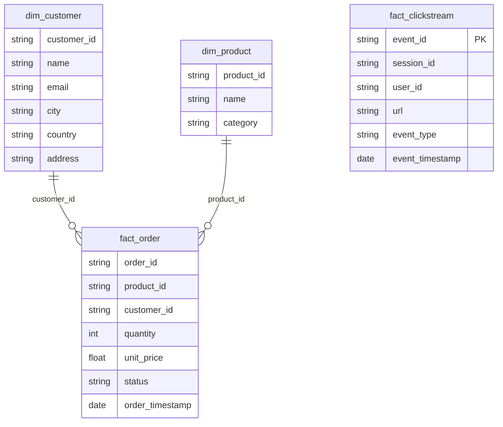
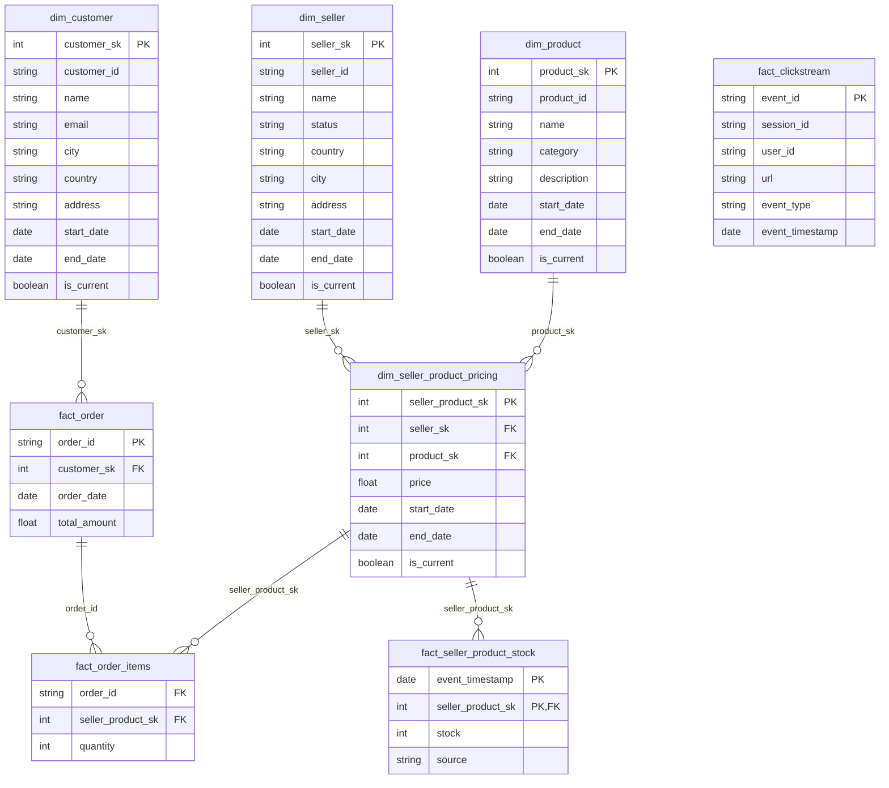

# Base de données – Data Warehouse ShopNow

## 1. Introduction
Ce document présente la structure du **Data Warehouse (DWH)** de ShopNow, adapté au modèle Marketplace.  
Il inclut :

- Les **dimensions** et **faits**
- Les relations entre tables
- Les rôles et permissions pour les utilisateurs

---

## 2. Dimensions

### dim_customer
Représente les clients de ShopNow.

| Colonne       | Type         | Description                     |
|---------------|-------------|---------------------------------|
| customer_sk   | INT PK       | Clé sur la table                |
| customer_id   | VARCHAR(50)  | Identifiant unique du client    |
| name          | NVARCHAR(255)| Nom du client                   |
| email         | NVARCHAR(255)| Email du client                 |
| city          | NVARCHAR(100)| Ville                           |
| country       | NVARCHAR(100)| Pays                            |
| address       | NVARCHAR(500)| Adresse                         |
| start_date    | DATE         | Date de début de validité       |
| end_date      | DATE         | Date de fin de validité         |
| is_current    | BIT          | Indique si l’enregistrement est actif |

---

### dim_seller
Représente les vendeurs Marketplace.

| Colonne       | Type         | Description                     |
|---------------|-------------|---------------------------------|
| seller_sk     | INT PK       | Clé sur la table                |
| seller_id     | VARCHAR(50)  | Identifiant unique du vendeur   |
| name          | NVARCHAR(255)| Nom du vendeur                  |
| status        | NVARCHAR(50) | Statut du vendeur               |
| country       | NVARCHAR(100)| Pays                            |
| city          | NVARCHAR(100)| Ville                           |
| address       | NVARCHAR(500)| Adresse                         |
| start_date    | DATE         | Date de début                   |
| end_date      | DATE         | Date de fin                     |
| is_current    | BIT          | Actif ou non                    |

---

### dim_product
Représente les produits vendus sur la plateforme.

| Colonne       | Type         | Description                     |
|---------------|-------------|---------------------------------|
| product_sk    | INT PK       | Clé sur la table                |
| product_id    | VARCHAR(50)  | Identifiant unique du produit   |
| name          | NVARCHAR(255)| Nom du produit                  |
| category      | NVARCHAR(100)| Catégorie                       |
| description   | NVARCHAR(MAX)| Description du produit          |
| start_date    | DATE         | Date de début                   |
| end_date      | DATE         | Date de fin                     |
| is_current    | BIT          | Actif ou non                    |

---

### dim_seller_product_pricing
Associe les vendeurs aux produits et leurs prix.

| Colonne            | Type  | Description                     |
|-------------------|-------|---------------------------------|
| seller_product_sk  | INT PK| Clé primaire                    |
| seller_sk          | INT FK| Référence `dim_seller`          |
| product_sk         | INT FK| Référence `dim_product`         |
| price              | DECIMAL(18,2)| Prix du produit           |
| start_date         | DATE  | Date de début                   |
| end_date           | DATE  | Date de fin                     |
| is_current         | BIT   | Actif ou non                    |

---

## 3. Tables de faits

### fact_order
Représente les commandes des clients.

| Colonne       | Type         | Description                     |
|---------------|-------------|---------------------------------|
| order_id      | VARCHAR(50) PK | Identifiant de la commande    |
| customer_sk   | INT FK       | Référence `dim_customer`       |
| order_date    | DATE         | Date de la commande            |
| total_amount  | DECIMAL(18,2)| Montant total                  |

---

### fact_order_items
Détails des produits commandés par commande.

| Colonne             | Type   | Description                       |
|-------------------|--------|-----------------------------------|
| order_id           | VARCHAR(50) FK | Référence `fact_order`       |
| seller_product_sk  | INT FK | Référence `dim_seller_product_pricing` |
| quantity           | INT    | Quantité commandée                |

---

### fact_seller_product_stock
Historique des stocks par produit et vendeur.

| Colonne            | Type     | Description                     |
|-------------------|---------|---------------------------------|
| seller_product_sk  | INT PK,FK | Référence `dim_seller_product_pricing` |
| event_timestamp    | DATETIME PK | Date/heure de l’événement       |
| stock              | INT     | Quantité en stock               |
| source             | NVARCHAR(100)| Source de l’information      |

---

### fact_clickstream
Événements de navigation des utilisateurs.

| Colonne         | Type         | Description                     |
|----------------|-------------|---------------------------------|
| event_id       | VARCHAR(50) PK | Identifiant unique             |
| session_id     | VARCHAR(50)  | Identifiant de session          |
| user_id        | VARCHAR(50)  | Identifiant de l’utilisateur   |
| url            | NVARCHAR(MAX)| Page visitée                    |
| event_type     | NVARCHAR(50) | Type d’événement                |
| event_timestamp| DATETIME     | Date/heure de l’événement       |

---

## 4. Relations entre tables

### Avant

### Proposition nouveau schema

## 5. Rôles et permissions

| Rôle |	Description |	Permissions principales|
|----------------|-------------|--------------------------------|
|role_data_engineer |	Gestion ETL, schémas, tables, dbt	| CRUD sur schémas, contrôle complet|
|role_system_admin |	Infrastructure, monitoring, backups	| Lecture globale, ALTER, BACKUP|
|role_quality_operator |	Contrôle qualité, validation des données	| Lecture, création objets qualité|
|role_data_governance |	Documentation, conformité RGPD, gestion accès |	Lecture complète, création vues, gestion utilisateurs|
|role_read_only	| Analystes, BI |	Lecture seule sur marts|

## 6. Schémas supplémentaires

- staging : tables  pour transformations intermédiaires

- marts : tables destinées aux analyses et reporting