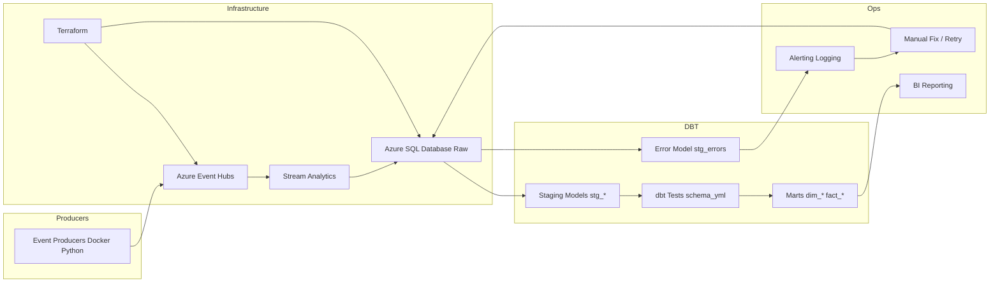

```mermaid
flowchart LR

  subgraph Producers
    P[Event Producers Docker Python]
  end

  subgraph Infrastructure
    TF[Terraform]
    EH[Azure Event Hubs]
    SA[Stream Analytics]
    SQL[Azure SQL Database Raw]
  end

  subgraph DBT
    ERR[Error Model stg_errors]
    STG[Staging Models stg_*]
    TESTS[dbt Tests schema_yml]
    MARTS[Marts dim_* fact_*]
  end

  subgraph Ops
    ALERT[Alerting Logging]
    FIX[Manual Fix / Retry]
    BI[BI Reporting]
  end

  P --> EH
  TF --> EH
  EH --> SA
  SA --> SQL
  TF --> SQL

  SQL --> ERR
  ERR --> ALERT
  ALERT --> FIX
  FIX --> SQL

  SQL --> STG
  STG --> TESTS
  TESTS --> MARTS
  MARTS --> BI
```