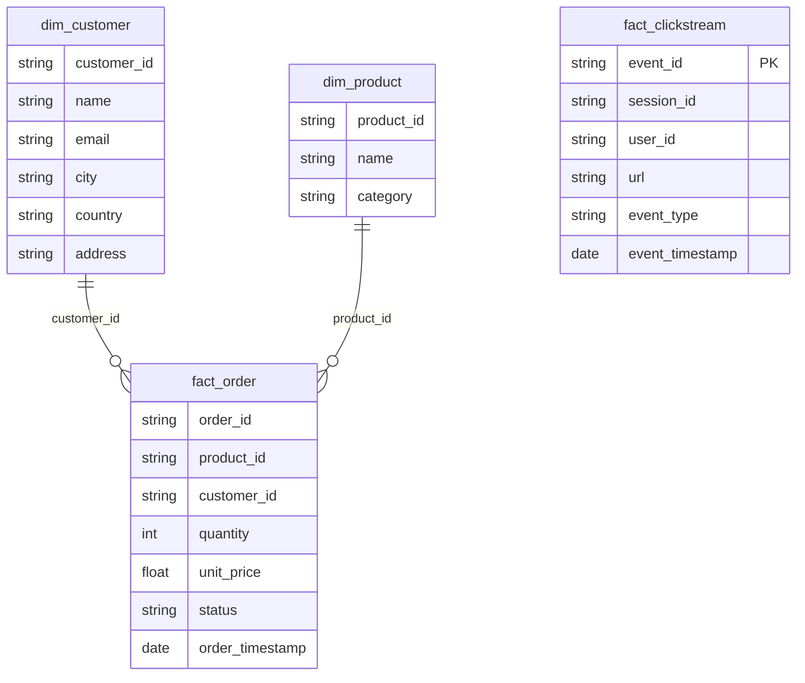
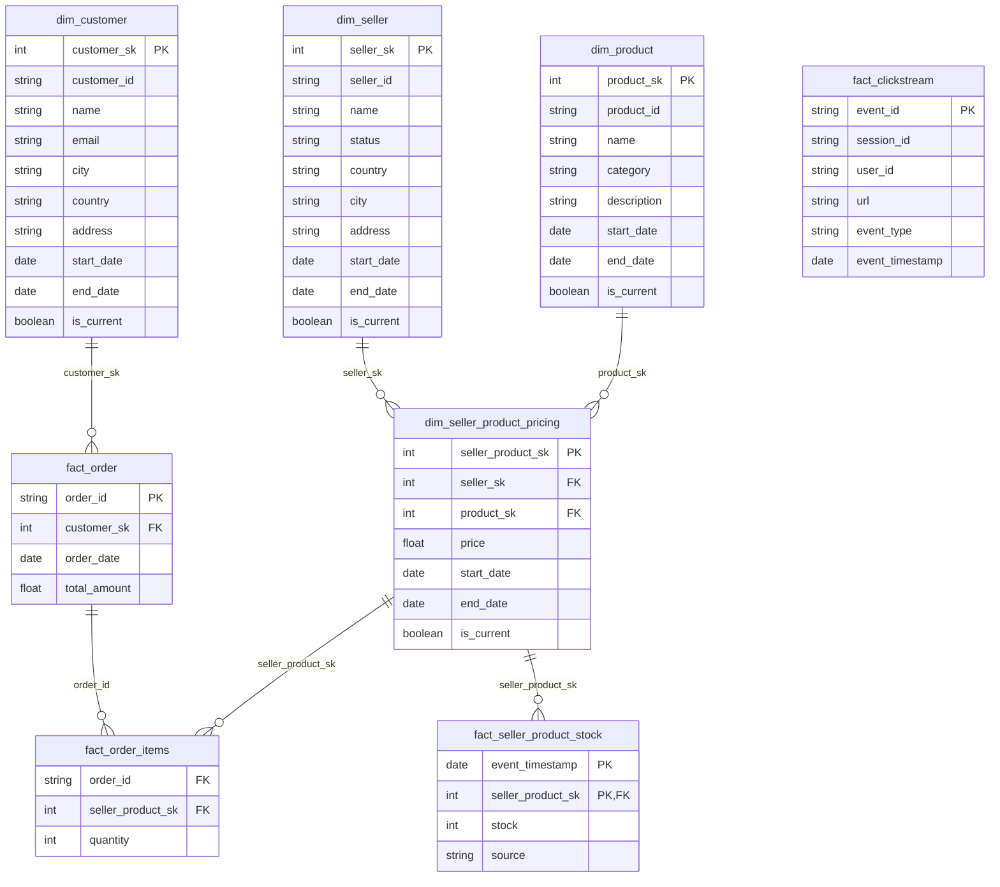

# Avant

```mermaid
erDiagram

    %% =======================
    %% DIMENSIONS
    %% =======================

    dim_customer {
        string customer_id
        string name
        string email
        string city
        string country
        string address
    }

    dim_product {
        string product_id
        string name
        string category
    }

    %% =======================
    %% FACTS
    %% =======================

    fact_order {
        string order_id
        string product_id
        string customer_id
        int quantity        
        float unit_price
        string status
        date order_timestamp
    }


    fact_clickstream {
        string event_id PK
        string session_id 
        string user_id    
        string url        
        string event_type 
        date   event_timestamp 
    }

    %% =======================
    %% RELATIONS
    %% =======================

    dim_customer ||--o{ fact_order : customer_id
    dim_product ||--o{ fact_order : product_id

```

# Proposition nouveau schema

```mermaid
erDiagram

    %% =======================
    %% DIMENSIONS
    %% =======================

    dim_customer {
        int    customer_sk PK
        string customer_id
        string name
        string email
        string city
        string country
        string address
        date   start_date
        date   end_date
        boolean is_current
    }

    dim_seller {
        int    seller_sk PK
        string seller_id 
        string name
        string status
        string country
        string city
        string address
        date   start_date
        date   end_date
        boolean is_current
    }

    dim_product {
        int    product_sk PK
        string product_id
        string name
        string category
        string description
        date   start_date
        date   end_date
        boolean is_current
    }

    dim_seller_product_pricing {
        int    seller_product_sk PK
        int    seller_sk FK
        int    product_sk FK
        float  price
        date   start_date
        date   end_date
        boolean is_current
    }

    %% =======================
    %% FACTS
    %% =======================

    fact_order {
        string order_id PK
        int    customer_sk FK
        date    order_date
        float  total_amount
    }

    fact_order_items {
        string order_id FK
        int    seller_product_sk FK
        int    quantity
    }

    fact_seller_product_stock {
        date   event_timestamp PK
        int    seller_product_sk PK,FK
        int    stock
        string source
    }

    fact_clickstream {
        string event_id PK
        string session_id 
        string user_id    
        string url        
        string event_type 
        date   event_timestamp 
    }

    %% =======================
    %% RELATIONS
    %% =======================

    dim_customer ||--o{ fact_order : customer_sk

    fact_order ||--o{ fact_order_items : order_id

    dim_seller ||--o{ dim_seller_product_pricing : seller_sk
    dim_product ||--o{ dim_seller_product_pricing : product_sk

    dim_seller_product_pricing ||--o{ fact_order_items : seller_product_sk
    dim_seller_product_pricing ||--o{ fact_seller_product_stock : seller_product_sk
```